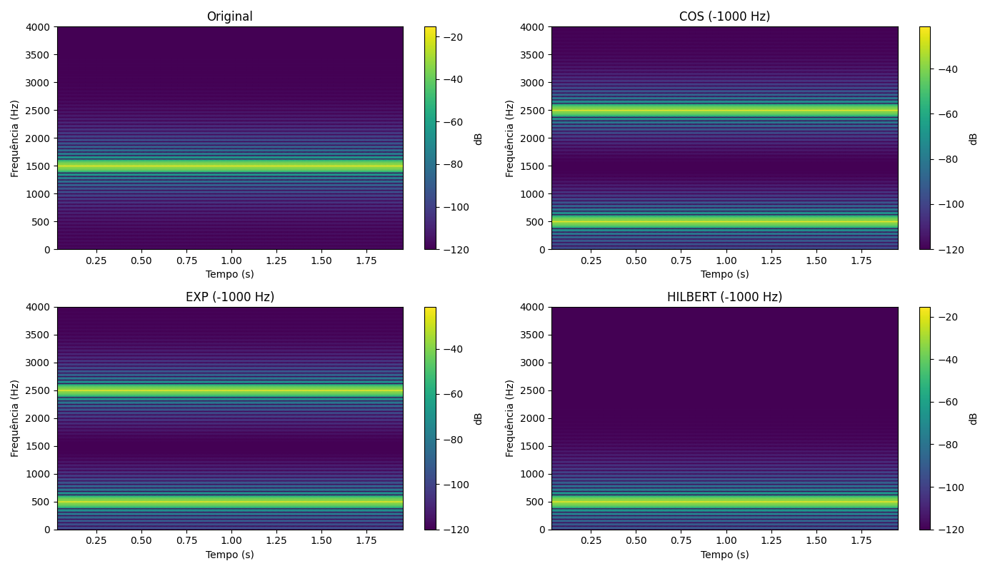

## Técnicas de deslocamento de frequência

### 🔹 1. **Multiplicação por um cosseno ou seno (modulação AM)**

- A técnica mais clássica: multiplicar o sinal por uma função cossenoidal `cos(2πf₀t)` ou senoidal.
- Isso resulta em **duas réplicas do espectro original**, uma centrada em `+f₀` e outra em `f₀`.
- Muito comum em **modulação em amplitude (AM)** e em **SSB (Single Side Band)**.

---

### 🔹 2. **Multiplicação por exponencial complexa**

- Multiplicação do sinal por `exp(j2πf₀t)` desloca **todo o espectro** para a direita (`+f₀`), sem criar réplica simétrica.
- Utilizada em sistemas de **modulação complexa**, como QAM e OFDM.
- Ideal para **deslocamento unilateral**, como em SSB (banda lateral única).

---

### 🔹 3. **FFT com rotação de espectro (frequência discreta)**

- Você pode realizar a **transformada rápida de Fourier (FFT)**, aplicar uma **rotação ou deslocamento do espectro** no domínio da frequência, e depois aplicar a **IFFT (transformada inversa)**.
- Muito usada em implementações digitais, principalmente para efeitos em áudio e aplicações em rádio definido por software (SDR).

---

### 🔹 4. **Modulação em banda base / IQ (In-phase e Quadrature)**

- Técnica usada em rádios SDR: separar o sinal em componentes **I (coseno)** e **Q (seno)** e fazer processamento digital com esses componentes.
- Permite controle preciso do deslocamento de frequência e evita aliasing.
- Essencial em rádios modernos, transmissões digitais e DSP.

---

### 🔹 5. **Hilbert Transform + modulação**

- Primeiro aplica-se a **Transformada de Hilbert** para criar um **sinal analítico** (componente complexa).
- Depois multiplica-se esse sinal analítico por uma exponencial complexa para deslocar a frequência.
- Essa abordagem evita a duplicação do espectro negativo (ideal para SSB).
- Muito usado em **SSB, análise de sinais e filtros adaptativos**.

---

### 🔹 6. **Interpolação e mudança de taxa (resampling)**

- Mudar a **taxa de amostragem** (upsampling/downsampling) altera a faixa de frequências representadas no sinal.
- Embora não seja diretamente um "deslocamento", pode **mover o conteúdo espectral** ao ser combinado com outras técnicas.

---

### 🔹 7. **Pitch shifting com phase vocoder / granular synthesis (áudio)**

- Em áudio musical, o deslocamento de frequência pode ser feito por vocoders de fase ou por granularização, para mudar o pitch sem alterar o tempo.
- São técnicas diferentes da modulação clássica, mas também realizam "deslocamento espectral" de uma forma perceptiva.

---

## Comparação entre as técnicas

| Técnica | Tipo de Sinal | Direção do Deslocamento | Réplica Espectral? | Complexidade | Aplicações Típicas |
| --- | --- | --- | --- | --- | --- |
| **Multiplicação por cosseno/seno** | Real | Bilateral (`±f₀`) | Sim (duas bandas) | Baixa | AM, áudio analógico |
| **Multiplicação por exponencial complexa** | Complexo | Unilateral (`+f₀` ou `-f₀`) | Não | Baixa | OFDM, QAM, SDR |
| **FFT com rotação espectral** | Real ou complexo | Controlada | Não (ou sim, dependendo do sinal) | Alta (com FFT/IFFT) | Análise de espectro, áudio digital |
| **Modulação IQ (I/Q)** | Complexo | Unilateral | Não | Média/Alta | Rádio digital, SDR |
| **Transformada de Hilbert + exponencial complexa** | Real → Complexo | Unilateral | Não | Média | SSB, análise espectral |
| **Resampling (mudança de taxa)** | Real ou complexo | Indireta (muda faixa útil) | Não aplicável diretamente | Média | DSP, compressão |
| **Phase vocoder / granular (áudio)** | Real | Perceptivo (pitch/timbre) | Não | Alta | Efeitos de áudio, música |

